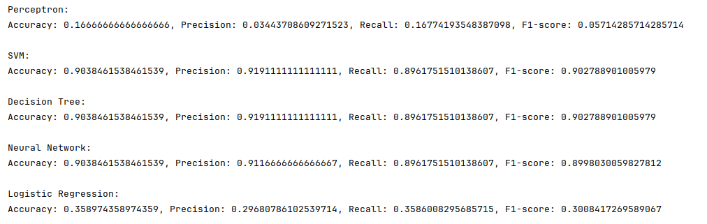
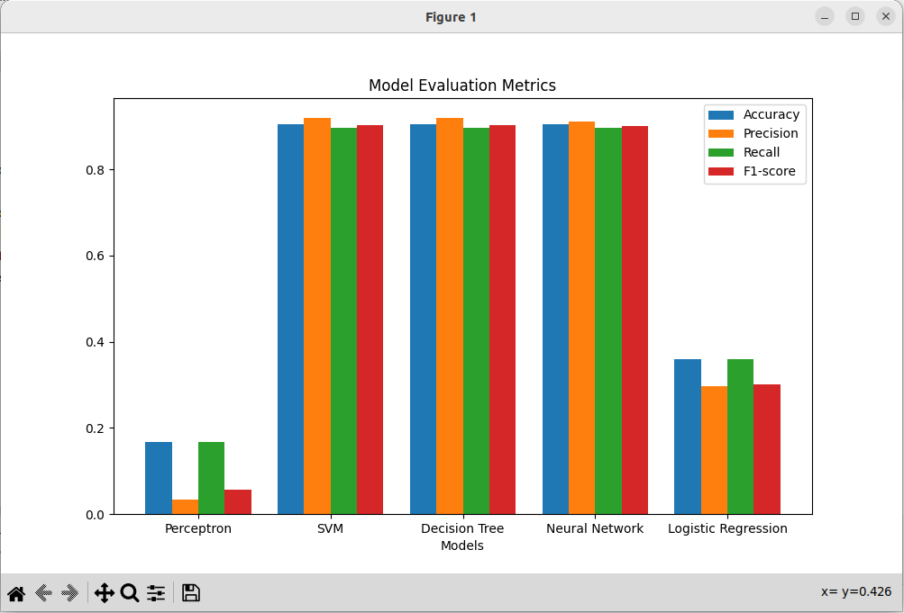

# Nội dung code

Kết quả chạy chương trình:

 

 

So sánh các mô hình phân lớp trong Machine Learning: Perceptron, SVM, Decision Tree, Neural Network, Logistic Regression qua các thông số Accuracy, Precision, Recall và F1-score

Vẽ biêu đồ so sánh

